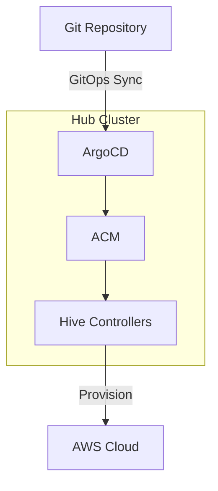

# OpenShift Cluster Provisioning with ArgoCD, ACM, and Hive

GitOps-based automation for provisioning and managing OpenShift clusters on AWS using Red Hat Advanced Cluster Management (ACM) and Hive.

## Overview

This repository provides a declarative, GitOps approach to OpenShift cluster lifecycle management:

- **ArgoCD**: Continuous deployment and cluster configuration management
- **ACM**: Multi-cluster management and governance
- **Hive**: Automated OpenShift cluster provisioning on cloud platforms

## Architecture



See [docs/architecture.md](docs/architecture.md) for detailed component interactions.

## Directory Structure

```
.
├── bootstrap/                    # ArgoCD bootstrap resources
│   ├── argocd-project.yaml      # AppProject with Hive/ACM permissions
│   ├── argocd-app-of-apps.yaml  # App-of-Apps pattern
│   └── deprovision-cleanup-cronjob.yaml
├── cluster-templates/            # Reusable cluster templates
│   └── aws-ha/base/             # AWS HA cluster template
├── clusters/                     # Cluster instances
│   └── <cluster-name>/          # One directory per cluster
├── secrets/                      # Secrets management guide
└── docs/                         # Detailed documentation
```

## Prerequisites

- OpenShift 4.12+ hub cluster
- Red Hat ACM 2.8+ installed
- OpenShift GitOps (ArgoCD) installed
- AWS account with appropriate permissions
- Route53 DNS zone for cluster domain

See [docs/prerequisites.md](docs/prerequisites.md) for installation steps.

## Quick Start

### 1. Clone and configure

```bash
git clone https://github.com/your-org/opl-argocd.git
cd opl-argocd

# Update repoURL in bootstrap/argocd-app-of-apps.yaml
```

### 2. Apply bootstrap resources

```bash
# Grant ArgoCD cluster-admin
oc create clusterrolebinding openshift-gitops-cluster-admin \
  --clusterrole=cluster-admin \
  --serviceaccount=openshift-gitops:openshift-gitops-argocd-application-controller

# Apply bootstrap
oc apply -f bootstrap/
```

### 3. Create cluster secrets

```bash
# Create namespace
oc create namespace <cluster-name>

# AWS credentials
oc create secret generic aws-credentials \
  --from-literal=aws_access_key_id=<key> \
  --from-literal=aws_secret_access_key=<secret> \
  -n <cluster-name>

# Pull secret (from console.redhat.com)
oc create secret generic pull-secret \
  --from-file=.dockerconfigjson=pull-secret.json \
  --type=kubernetes.io/dockerconfigjson \
  -n <cluster-name>

# SSH key
oc create secret generic <cluster-name>-ssh-key \
  --from-file=ssh-privatekey=<key-file> \
  --from-file=ssh-publickey=<key-file>.pub \
  --type=kubernetes.io/ssh-auth \
  -n <cluster-name>
```

See [secrets/README.md](secrets/README.md) for detailed guidance.

### 4. Add cluster configuration

See [docs/adding-clusters.md](docs/adding-clusters.md) or [clusters/README.md](clusters/README.md).

### 5. Monitor provisioning

```bash
# Watch ClusterDeployment
oc get clusterdeployment -n <cluster-name> -w

# View provision logs
oc logs -n <cluster-name> job/<cluster-name>-provision -f
```

Provisioning takes 30-45 minutes.

### 6. Access the cluster

```bash
oc extract secret/<cluster-name>-admin-kubeconfig -n <cluster-name> --to=.
export KUBECONFIG=./kubeconfig
oc get nodes
```

## Documentation

| Topic | Document |
|-------|----------|
| Architecture | [docs/architecture.md](docs/architecture.md) |
| Prerequisites | [docs/prerequisites.md](docs/prerequisites.md) |
| Adding Clusters | [docs/adding-clusters.md](docs/adding-clusters.md) |
| Cluster Operations | [docs/operations.md](docs/operations.md) |
| Troubleshooting | [docs/troubleshooting.md](docs/troubleshooting.md) |
| Advanced Features | [docs/advanced.md](docs/advanced.md) |
| AWS Template | [cluster-templates/aws-ha/README.md](cluster-templates/aws-ha/README.md) |
| Secrets Management | [secrets/README.md](secrets/README.md) |
| Bootstrap Resources | [bootstrap/README.md](bootstrap/README.md) |
| Cluster Directories | [clusters/README.md](clusters/README.md) |

### Workflow Diagrams

| Workflow | Document |
|----------|----------|
| Secret Lifecycle | [secret-persistence-workflow.md](secret-persistence-workflow.md) |
| Cluster Deletion | [cluster-deletion-workflow.md](cluster-deletion-workflow.md) |

## Key Operations

| Operation | Command/Action |
|-----------|----------------|
| **Add cluster** | Create directory in `clusters/`, commit and push |
| **Scale workers** | Update `replicas` in kustomization.yaml |
| **Hibernate** | `oc patch clusterdeployment <name> -n <ns> --type merge -p '{"spec":{"powerState":"Hibernating"}}'` |
| **Delete cluster** | Remove cluster directory from Git |
| **Access cluster** | `oc extract secret/<name>-admin-kubeconfig -n <ns> --to=.` |

See [docs/operations.md](docs/operations.md) for complete operations guide.

## Security Considerations

- Use Sealed Secrets or External Secrets Operator for production
- Restrict ArgoCD project permissions to specific namespaces
- Use IAM roles with minimal AWS permissions
- Implement network policies between clusters

See [secrets/README.md](secrets/README.md) for secrets management best practices.

## Best Practices

- Use separate AWS accounts for dev/staging/prod
- Enable hibernation for non-production environments
- Set `preserveOnDelete: true` to prevent accidental deletion
- Use ClusterSets in ACM to organize clusters
- Monitor cluster costs with AWS Cost Explorer tags

## Resources

- [OpenShift Hive Documentation](https://github.com/openshift/hive/tree/master/docs)
- [Red Hat ACM Documentation](https://access.redhat.com/documentation/en-us/red_hat_advanced_cluster_management_for_kubernetes/)
- [OpenShift GitOps Documentation](https://docs.openshift.com/container-platform/latest/cicd/gitops/understanding-openshift-gitops.html)
- [ArgoCD Documentation](https://argo-cd.readthedocs.io/)

## License

MIT License - See LICENSE file for details
