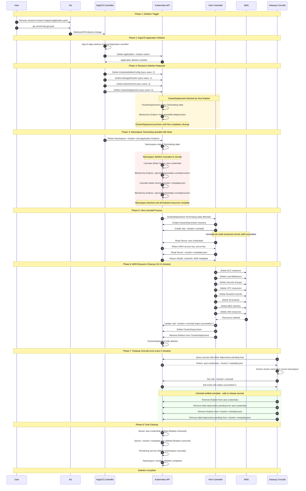

# Cluster Deletion Workflow

This diagram visualizes the complete cluster deletion process from trigger to completion.

## Key Components

| Component | Role |
|-----------|------|
| **Git Repository** | Source of truth for cluster state |
| **ArgoCD App-of-Apps** | Discovers and manages cluster Applications |
| **ArgoCD Controller** | Syncs desired state, handles deletion |
| **Hive Controller** | Manages ClusterDeployment lifecycle |
| **Uninstall Job** | Destroys AWS infrastructure |
| **Cleanup CronJob** | Removes finalizers after uninstall completes |

## Finalizer Protection

Two finalizer mechanisms work together to ensure proper cleanup:

### Secret Finalizers (`openshiftpartnerlabs.com/deprovision`)
Applied to `aws-credentials` and `<cluster>-metadata-json` secrets:
1. Secrets enter Terminating state but persist until finalizer is removed
2. Uninstall job can read secrets while they are in Terminating state
3. CronJob removes finalizers only after uninstall job succeeds

### ClusterDeployment Finalizer (`hive.openshift.io/deprovision`)
Applied by Hive to ClusterDeployment:
1. ClusterDeployment enters Terminating state when deleted
2. Hive creates uninstall job and waits for AWS cleanup
3. Hive removes finalizer only after AWS resources are deleted

## Timing

| Phase | Description | Duration |
|-------|-------------|----------|
| 1-2 | ArgoCD detection and Application deletion | 1-3 minutes |
| 3-5 | Resource deletion requests and Hive uninstall start | < 1 minute |
| 6 | AWS resource cleanup | 10-15 minutes |
| 7 | CronJob finalizer removal | Up to 5 minutes (next scheduled run) |
| 8 | Final namespace cleanup | < 1 minute |
| **Total** | | **15-25 minutes** |
