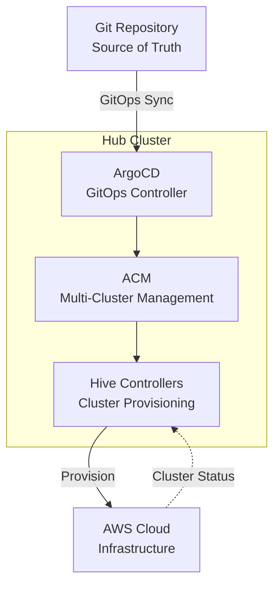
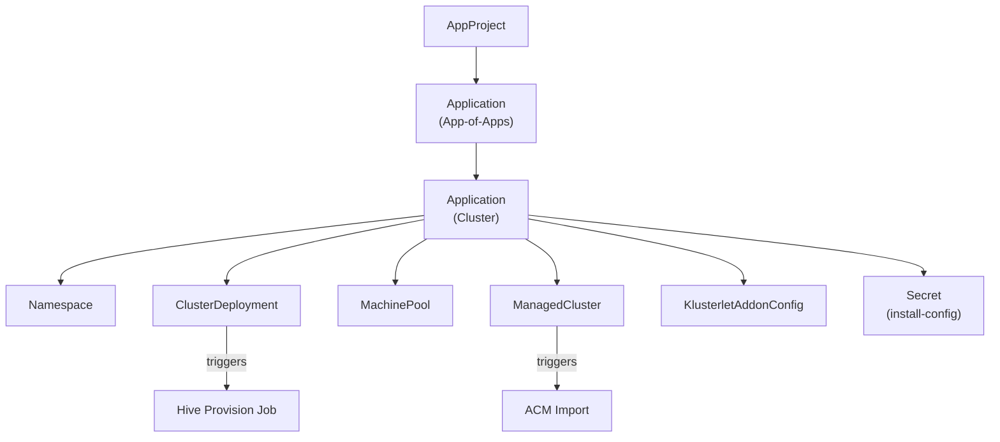

# Architecture

This document describes the architecture and component interactions for GitOps-based OpenShift cluster provisioning.

## Component Overview

## Components

| Component | Purpose |
|-----------|---------|
| **ArgoCD** | Continuous deployment from Git, manages Application resources |
| **ACM** | Multi-cluster management, imports clusters via ManagedCluster |
| **Hive** | Provisions OpenShift clusters on cloud platforms |
| **Git Repository** | Source of truth for cluster configurations |
| **AWS** | Cloud provider for cluster infrastructure |

## Data Flow

### Cluster Creation Flow

1. **User** commits cluster configuration to Git
2. **ArgoCD App-of-Apps** detects new `argocd-application.yaml`
3. **ArgoCD** creates Application and syncs cluster resources
4. **Hive** receives ClusterDeployment, creates provision job
5. **Provision Job** creates AWS infrastructure
6. **Hive** creates cluster secrets (metadata-json, admin-kubeconfig)
7. **PostSync Job** adds finalizers to protect secrets
8. **ACM** imports cluster via ManagedCluster

### Cluster Deletion Flow

1. **User** removes cluster directory from Git
2. **ArgoCD App-of-Apps** prunes the Application
3. **ArgoCD** deletes cluster resources
4. **Hive** detects ClusterDeployment deletion, creates uninstall job
5. **Uninstall Job** deletes AWS resources (10-15 minutes)
6. **CronJob** detects uninstall complete, removes finalizers
7. **Kubernetes** deletes secrets, namespace completes termination

See [cluster-deletion-workflow.md](../cluster-deletion-workflow.md) for detailed sequence diagram.

## Resource Relationships

## Secret Protection Mechanism

Two finalizer mechanisms ensure secrets persist until AWS cleanup completes:

| Finalizer | Applied To | Applied By | Removed By |
|-----------|------------|------------|------------|
| `openshiftpartnerlabs.com/deprovision` | aws-credentials, metadata-json secrets | PostSync Job | Cleanup CronJob |
| `hive.openshift.io/deprovision` | ClusterDeployment | Hive | Hive (after uninstall) |

See [secret-persistence-workflow.md](../secret-persistence-workflow.md) for detailed lifecycle.

## Sync Waves

Resources are created in order using ArgoCD sync waves:

| Wave | Resources |
|------|-----------|
| -1 | install-config Secret |
| 0 | ClusterDeployment, MachinePool |
| 1 | ManagedCluster |
| 2 | KlusterletAddonConfig |
| PostSync | Finalizer Job (adds protection to secrets) |
