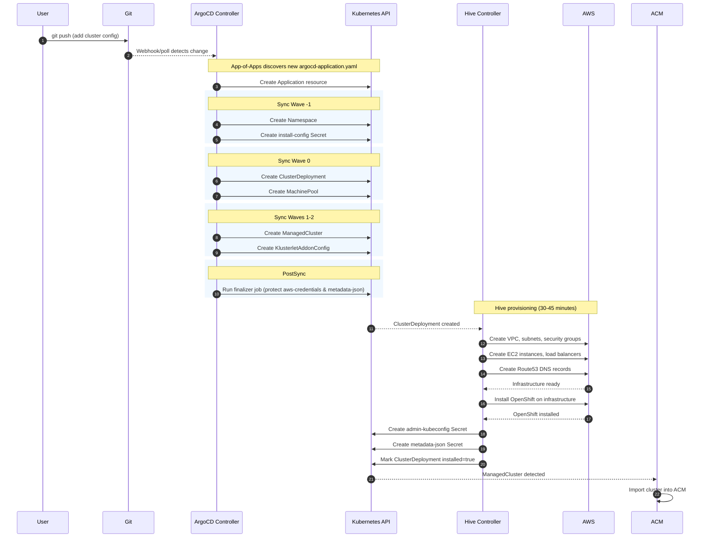
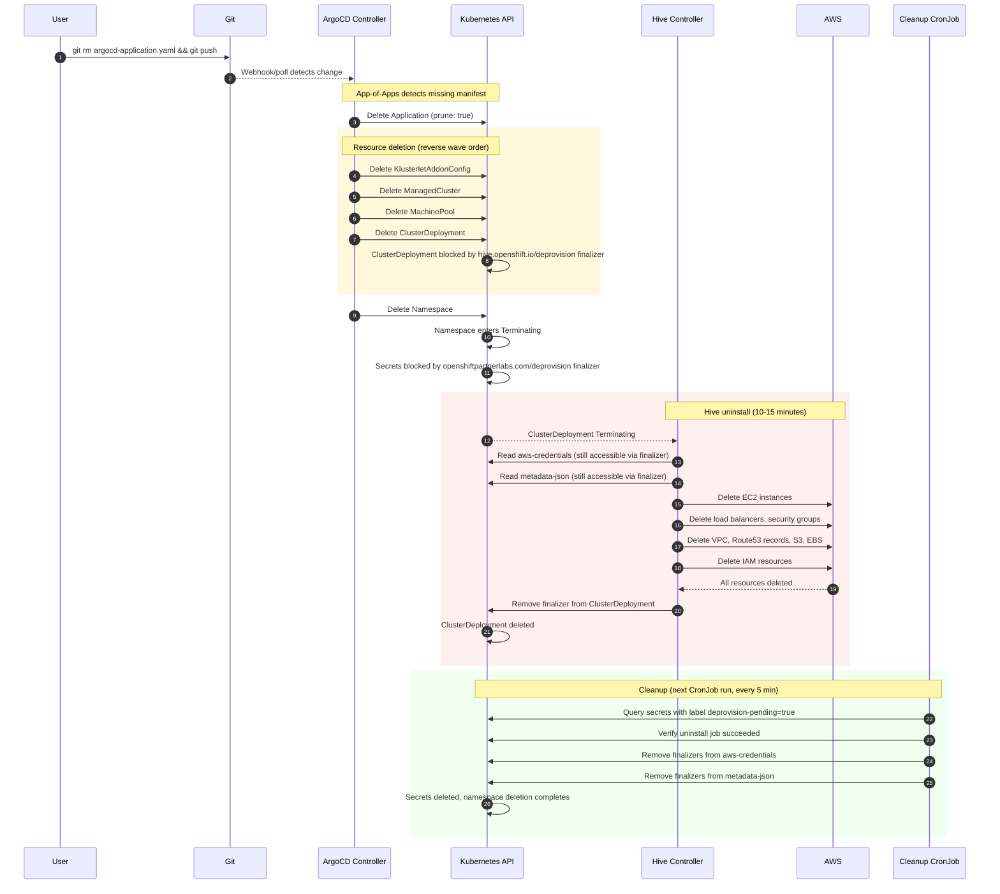

# Demo Guide: Creating and Deleting an OpenShift Cluster

This guide walks through the full end-to-end process of using this repository to provision a new OpenShift cluster on AWS and then deprovision it — all driven by Git commits.

By the end you will have:

- Bootstrapped the ArgoCD GitOps pipeline on your hub cluster
- Provisioned a new OpenShift cluster on AWS via a Git commit
- Accessed the new cluster
- Deprovisioned the cluster by removing a single file from Git

## 1. Prerequisites

Before starting, ensure the following are in place.

### Hub Cluster

- OpenShift 4.12+ cluster (the "hub") with cluster-admin access
- Red Hat Advanced Cluster Management (ACM) 2.8+ operator installed
- OpenShift GitOps (ArgoCD) operator installed
- Hive is included with ACM — no separate install needed

### AWS

- An AWS account with permissions for: EC2, ELB, Route53, S3, IAM, VPC, EBS
- A Route53 public hosted zone for your base domain (e.g. `example.com`)
- Sufficient service quotas in your target region for the instance types you plan to use

### CLI Tools

- `oc` — OpenShift CLI, logged in to the hub cluster
- `git` — to clone and push to this repository
- `ssh-keygen` — to generate an SSH key pair for node access

### Credentials

- AWS access key ID and secret access key
- Red Hat pull secret (download from [console.redhat.com](https://console.redhat.com/openshift/install/pull-secret))

### OpenShift Version

Confirm a `ClusterImageSet` exists on the hub for the version you want to deploy:

```bash
oc get clusterimageset
```

Note the name of the image set you want to use (e.g. `img4.20.10-x86-64-appsub`).

## 2. Bootstrap Setup (One-Time)

These steps configure ArgoCD on the hub cluster to watch this repository. You only need to do this once.

### 2.1 Clone the repository

```bash
git clone <repo-url>
cd labargocd
```

> Update `spec.source.repoURL` in `bootstrap/argocd-app-of-apps.yaml` if your fork URL differs from the one already configured.

### 2.2 Grant ArgoCD cluster-admin

ArgoCD needs permission to create Hive and ACM resources:

```bash
oc create clusterrolebinding openshift-gitops-cluster-admin \
  --clusterrole=cluster-admin \
  --serviceaccount=openshift-gitops:openshift-gitops-argocd-application-controller
```

### 2.3 Apply bootstrap resources

```bash
oc apply -f bootstrap/
```

This creates:

| Resource | Purpose |
|----------|---------|
| `AppProject` | Grants ArgoCD permission to manage Hive/ACM resource types |
| `Application` (App-of-Apps) | Watches `clusters/*/argocd-application.yaml` for new cluster definitions |
| `CronJob` | Runs every 5 minutes to clean up finalizers after cluster deletion |

### 2.4 Verify bootstrap

```bash
# AppProject exists
oc get appproject cluster-provisioning-argocd -n openshift-gitops

# App-of-Apps Application exists and is healthy
oc get application cluster-provisioning-apps-argocd -n openshift-gitops

# Cleanup CronJob is scheduled
oc get cronjob deprovision-cleanup -n openshift-gitops
```

## 3. Creating a Cluster

### 3.1 Create the directory structure

```bash
mkdir -p clusters/<cluster-name>/patches
```

### 3.2 Create the ArgoCD Application manifest

Create `clusters/<cluster-name>/argocd-application.yaml`:

```yaml
---
apiVersion: argoproj.io/v1alpha1
kind: Application
metadata:
  name: <cluster-name>
  namespace: openshift-gitops
  annotations:
    argocd.argoproj.io/sync-wave: "10"
  labels:
    cluster-name: <cluster-name>
    environment: <environment>
  finalizers:
    - resources-finalizer.argocd.argoproj.io
spec:
  project: cluster-provisioning-argocd

  source:
    repoURL: <repo-url>
    targetRevision: main
    path: clusters/<cluster-name>

  destination:
    server: https://kubernetes.default.svc
    namespace: <cluster-name>

  syncPolicy:
    automated:
      prune: true
      selfHeal: true
      allowEmpty: true
    syncOptions:
      - CreateNamespace=true
    retry:
      limit: 5
      backoff:
        duration: 5s
        factor: 2
        maxDuration: 10m

  ignoreDifferences:
    - group: hive.openshift.io
      kind: ClusterDeployment
      jsonPointers:
        - /status
        - /spec/clusterMetadata
        - /spec/installed
    - group: cluster.open-cluster-management.io
      kind: ManagedCluster
      jsonPointers:
        - /status
        - /spec/managedClusterClientConfigs
```

Replace all `<cluster-name>`, `<environment>`, and `<repo-url>` values.

### 3.3 Create the Kustomize overlay

Create `clusters/<cluster-name>/kustomization.yaml`:

```yaml
apiVersion: kustomize.config.k8s.io/v1beta1
kind: Kustomization

namespace: <cluster-name>

resources:
  - ../../cluster-templates/aws-ha/base

patches:
  # Install config secret content
  - path: patches/install-config.yaml

  # ClusterDeployment
  - target:
      kind: ClusterDeployment
      name: cluster-placeholder
    patch: |-
      - op: replace
        path: /metadata/name
        value: <cluster-name>
      - op: replace
        path: /spec/clusterName
        value: <cluster-name>
      - op: replace
        path: /spec/baseDomain
        value: <base-domain>
      - op: replace
        path: /spec/platform/aws/region
        value: <region>
      - op: replace
        path: /spec/provisioning/imageSetRef/name
        value: <cluster-image-set>
      - op: replace
        path: /spec/provisioning/installConfigSecretRef/name
        value: <cluster-name>-install-config
      - op: replace
        path: /spec/provisioning/sshPrivateKeySecretRef/name
        value: <cluster-name>-ssh-key
      - op: remove
        path: /spec/provisioning/manifestsConfigMapRef

  # MachinePool
  - target:
      kind: MachinePool
      name: cluster-placeholder-worker
    patch: |-
      - op: replace
        path: /metadata/name
        value: <cluster-name>-worker
      - op: replace
        path: /spec/clusterDeploymentRef/name
        value: <cluster-name>
      - op: replace
        path: /spec/replicas
        value: <worker-replicas>
      - op: replace
        path: /spec/platform/aws/type
        value: <worker-instance-type>

  # ManagedCluster
  - target:
      kind: ManagedCluster
      name: cluster-placeholder
    patch: |-
      - op: replace
        path: /metadata/name
        value: <cluster-name>
      - op: add
        path: /metadata/labels/environment
        value: <environment>

  # KlusterletAddonConfig
  - target:
      kind: KlusterletAddonConfig
      name: cluster-placeholder
    patch: |-
      - op: replace
        path: /metadata/name
        value: <cluster-name>
      - op: replace
        path: /spec/clusterName
        value: <cluster-name>
      - op: replace
        path: /spec/clusterNamespace
        value: <cluster-name>

  # Install-config Secret
  - target:
      kind: Secret
      name: cluster-placeholder-install-config
    patch: |-
      - op: replace
        path: /metadata/name
        value: <cluster-name>-install-config
```

### 3.4 Create the install-config patch

Create `clusters/<cluster-name>/patches/install-config.yaml`:

```yaml
apiVersion: v1
kind: Secret
metadata:
  name: cluster-placeholder-install-config
  namespace: cluster-placeholder
stringData:
  install-config.yaml: |
    apiVersion: v1
    baseDomain: <base-domain>
    metadata:
      name: <cluster-name>

    controlPlane:
      name: master
      platform:
        aws:
          type: <master-instance-type>
          rootVolume:
            iops: 4000
            size: 120
            type: gp3
          zones:
            - <az-1>
      replicas: <master-replicas>

    compute:
      - name: worker
        platform:
          aws:
            type: <worker-instance-type>
            rootVolume:
              iops: 2000
              size: 100
              type: gp3
            zones:
              - <az-1>
        replicas: <worker-replicas>

    networking:
      clusterNetwork:
        - cidr: 10.128.0.0/14
          hostPrefix: 23
      machineNetwork:
        - cidr: 10.0.0.0/16
      serviceNetwork:
        - 172.30.0.0/16
      networkType: OVNKubernetes

    platform:
      aws:
        region: <region>

    fips: false
    publish: External
```

### Placeholder Reference

| Placeholder | Description | Example |
|-------------|-------------|---------|
| `<cluster-name>` | Unique cluster identifier (lowercase, alphanumeric, hyphens) | `demo-cluster` |
| `<base-domain>` | Route53 hosted zone domain | `example.com` |
| `<region>` | AWS region | `us-east-1` |
| `<az-1>` | Availability zone | `us-east-1a` |
| `<cluster-image-set>` | ClusterImageSet name from `oc get clusterimageset` | `img4.20.10-x86-64-appsub` |
| `<master-instance-type>` | EC2 instance type for control plane | `m5.2xlarge` |
| `<master-replicas>` | Number of control plane nodes (1 or 3) | `3` |
| `<worker-instance-type>` | EC2 instance type for workers | `m5.2xlarge` |
| `<worker-replicas>` | Number of worker nodes | `3` |
| `<environment>` | Environment label | `development` |
| `<repo-url>` | Git repository URL | `https://github.com/org/labargocd.git` |

### 3.5 Create secrets on the hub cluster

These secrets must exist in the cluster namespace **before** ArgoCD syncs the cluster resources.

```bash
# Create the namespace
oc create namespace <cluster-name>

# AWS credentials
oc create secret generic aws-credentials \
  --from-literal=aws_access_key_id=<aws-access-key> \
  --from-literal=aws_secret_access_key=<aws-secret-key> \
  -n <cluster-name>

# Red Hat pull secret
oc create secret generic pull-secret \
  --from-file=.dockerconfigjson=<path-to-pull-secret.json> \
  --type=kubernetes.io/dockerconfigjson \
  -n <cluster-name>

# SSH key pair (generate one if you don't have one)
ssh-keygen -t rsa -b 4096 -f <cluster-name>-ssh-key -N ""

oc create secret generic <cluster-name>-ssh-key \
  --from-file=ssh-privatekey=<cluster-name>-ssh-key \
  --from-file=ssh-publickey=<cluster-name>-ssh-key.pub \
  --type=kubernetes.io/ssh-auth \
  -n <cluster-name>
```

### 3.6 Commit and push

```bash
git add clusters/<cluster-name>/
git commit -m "Add <cluster-name> cluster"
git push
```

Once pushed, the ArgoCD App-of-Apps detects the new `argocd-application.yaml`, creates the Application, and begins syncing the cluster resources. Hive then provisions the cluster on AWS.

### 3.7 Monitor provisioning

```bash
# ArgoCD Application status
oc get application <cluster-name> -n openshift-gitops

# ClusterDeployment status (watch until installed=true)
oc get clusterdeployment <cluster-name> -n <cluster-name> -w

# Provision job logs (appears after Hive starts provisioning)
oc logs -n <cluster-name> -l hive.openshift.io/cluster-deployment-name=<cluster-name> -f

# Overall pod activity
oc get pods -n <cluster-name> -w
```

Provisioning typically completes in 30-45 minutes. The `ClusterDeployment` status transitions through:
`Provisioning` -> `WaitForInstall` -> `Installed`

### 3.8 Access the new cluster

Once the ClusterDeployment shows `installed: true`:

```bash
# Extract the admin kubeconfig
oc extract secret/<cluster-name>-admin-kubeconfig -n <cluster-name> --to=.

# Use it to access the new cluster
export KUBECONFIG=./kubeconfig
oc get nodes
oc get clusterversion
```

The cluster console URL and admin credentials can also be found:

```bash
# Console URL
oc get clusterdeployment <cluster-name> -n <cluster-name> -o jsonpath='{.status.webConsoleURL}'

# Admin password
oc extract secret/<cluster-name>-admin-password -n <cluster-name> --to=-
```

## 4. Deleting a Cluster

Cluster deletion is triggered by removing the ArgoCD Application manifest from Git. ArgoCD, Hive, and the cleanup CronJob handle the rest automatically.

### 4.1 Remove the Application manifest

```bash
git rm clusters/<cluster-name>/argocd-application.yaml
git commit -m "Remove <cluster-name> cluster"
git push
```

> Only the `argocd-application.yaml` file needs to be removed. The remaining files (`kustomization.yaml`, `patches/`) can be left in place or removed later — they have no effect without the Application manifest.

### 4.2 Monitor deletion

```bash
# Watch the ArgoCD Application disappear
oc get application <cluster-name> -n openshift-gitops -w

# Watch the ClusterDeployment enter Terminating state
oc get clusterdeployment -n <cluster-name> -w

# Watch the Hive uninstall job run
oc get jobs -n <cluster-name> -w

# Watch uninstall job logs
oc logs -n <cluster-name> job/<cluster-name>-uninstall -f
```

### 4.3 Verify deletion is complete

```bash
# Namespace should be gone
oc get namespace <cluster-name>
# Expected: Error from server (NotFound)

# No ArgoCD Application
oc get application <cluster-name> -n openshift-gitops
# Expected: Error from server (NotFound)
```

### 4.4 Clean up remaining files (optional)

If you want to remove the cluster configuration from the repository entirely:

```bash
git rm -r clusters/<cluster-name>/
git commit -m "Clean up <cluster-name> configuration files"
git push
```

## 5. What Happens Behind the Scenes

### Cluster Creation Flow



### Cluster Deletion Flow



For detailed sequence diagrams, see [cluster-deletion-workflow.md](../cluster-deletion-workflow.md) and [secret-persistence-workflow.md](../secret-persistence-workflow.md).

## 6. Troubleshooting

### ArgoCD Application not appearing

The App-of-Apps looks for files matching `clusters/*/argocd-application.yaml`. Verify:

```bash
# File exists at the correct path
ls clusters/<cluster-name>/argocd-application.yaml

# App-of-Apps is healthy
oc get application cluster-provisioning-apps-argocd -n openshift-gitops
```

### Sync fails — secrets not found

Secrets must exist before ArgoCD syncs the cluster. If sync fails:

```bash
oc get secrets -n <cluster-name>
# Should show: aws-credentials, pull-secret, <cluster-name>-ssh-key
```

Create any missing secrets per step 3.5, then let ArgoCD retry (or trigger a manual sync).

### ClusterImageSet not found

```bash
oc get clusterimageset | grep <version>
```

If the desired version is not listed, the ACM operator may need an update, or you need to create the `ClusterImageSet` resource manually.

### Provisioning fails — check provision logs

```bash
oc get clusterprovision -n <cluster-name>
oc logs -n <cluster-name> -l hive.openshift.io/cluster-deployment-name=<cluster-name> --tail=100
```

Common causes: AWS quota exceeded, invalid credentials, DNS zone not found.

### Namespace stuck in Terminating after deletion

This usually means the cleanup CronJob hasn't run yet or the uninstall job failed:

```bash
# Check if uninstall job completed
oc get job <cluster-name>-uninstall -n <cluster-name>

# Check cleanup CronJob recent runs
oc get jobs -n openshift-gitops -l job-name=deprovision-cleanup --sort-by=.metadata.creationTimestamp

# If the uninstall job failed, check logs
oc logs -n <cluster-name> job/<cluster-name>-uninstall
```

If the uninstall job succeeded but finalizers remain, manually remove them:

```bash
oc patch secret aws-credentials -n <cluster-name> --type=json \
  -p='[{"op": "remove", "path": "/metadata/finalizers"}]'
oc patch secret <cluster-name>-metadata-json -n <cluster-name> --type=json \
  -p='[{"op": "remove", "path": "/metadata/finalizers"}]'
```

For additional troubleshooting guidance, see [troubleshooting.md](troubleshooting.md).
