# Secret Persistence Workflow

This diagram visualizes the complete ArgoCD application lifecycle from creation to deletion, focusing on how secrets are protected throughout the cluster's lifetime.

```mermaid
sequenceDiagram
    autonumber
    participant User
    participant Git
    participant ArgoCD as ArgoCD Controller
    participant K8s as Kubernetes API
    participant PostSync as PostSync Job
    participant Hive as Hive Controller
    participant AWS
    participant CronJob as Cleanup CronJob

    Note over User,CronJob: ══════════════════════════════════════════<br/>PHASE 1: Application Creation<br/>══════════════════════════════════════════

    User->>K8s: Create namespace: <cluster>
    User->>K8s: Create Secret: aws-credentials
    User->>K8s: Create Secret: pull-secret
    User->>K8s: Create Secret: <cluster>-ssh-key

    User->>Git: Add clusters/<cluster>/argocd-application.yaml
    User->>Git: Add clusters/<cluster>/kustomization.yaml
    User->>Git: git commit && git push

    Note over User,CronJob: ══════════════════════════════════════════<br/>PHASE 2: ArgoCD Sync<br/>══════════════════════════════════════════

    Git-->>ArgoCD: Webhook/Poll detects change
    ArgoCD->>ArgoCD: App-of-Apps discovers new Application
    ArgoCD->>K8s: Create Application: <cluster>
    ArgoCD->>ArgoCD: Kustomize builds manifests

    rect rgb(240, 248, 255)
        Note over ArgoCD,K8s: Sync Wave -1
        ArgoCD->>K8s: Create Secret: <cluster>-install-config
    end

    rect rgb(240, 255, 240)
        Note over ArgoCD,K8s: Sync Wave 0
        ArgoCD->>K8s: Create ClusterDeployment: <cluster>
        ArgoCD->>K8s: Create MachinePool: <cluster>-worker
    end

    rect rgb(255, 255, 240)
        Note over ArgoCD,K8s: Sync Wave 1
        ArgoCD->>K8s: Create ManagedCluster: <cluster>
    end

    rect rgb(255, 240, 255)
        Note over ArgoCD,K8s: Sync Wave 2
        ArgoCD->>K8s: Create KlusterletAddonConfig: <cluster>
    end

    ArgoCD->>K8s: Sync complete

    Note over User,CronJob: ══════════════════════════════════════════<br/>PHASE 3: PostSync Hook Execution<br/>══════════════════════════════════════════

    ArgoCD->>K8s: Create ServiceAccount: deprovision-finalizer-sa
    ArgoCD->>K8s: Create Role: deprovision-finalizer-role
    ArgoCD->>K8s: Create RoleBinding: deprovision-finalizer-binding
    ArgoCD->>K8s: Create Job: add-deprovision-finalizers
    K8s-->>PostSync: Job started

    Note over User,CronJob: ══════════════════════════════════════════<br/>PHASE 4: Cluster Provisioning (30-45 min)<br/>══════════════════════════════════════════

    K8s-->>Hive: ClusterDeployment detected
    Hive->>K8s: Create ClusterProvision
    Hive->>K8s: Create Job: <cluster>-provision
    Hive->>AWS: Create VPC, subnets, security groups
    Hive->>AWS: Create EC2 instances
    Hive->>AWS: Create load balancers
    Hive->>AWS: Create Route53 records

    loop PostSync polls every 30 seconds
        PostSync->>K8s: Check Secret: <cluster>-metadata-json exists?
        K8s-->>PostSync: Not found
        PostSync->>PostSync: Sleep 30 seconds
    end

    Note over Hive: Provisioning progresses...

    Hive->>K8s: Create Secret: <cluster>-metadata-json
    Hive->>K8s: Create Secret: <cluster>-admin-kubeconfig
    Hive->>K8s: Create Secret: <cluster>-admin-password
    Hive->>K8s: Update ClusterDeployment status: Provisioned

    Note over User,CronJob: ══════════════════════════════════════════<br/>PHASE 5: Finalizers Added to Secrets<br/>══════════════════════════════════════════

    PostSync->>K8s: Check Secret: <cluster>-metadata-json exists?
    K8s-->>PostSync: Found!

    rect rgb(255, 240, 240)
        Note over PostSync,K8s: Protecting aws-credentials
        PostSync->>K8s: Get Secret: aws-credentials
        PostSync->>K8s: Add finalizer: openshiftpartnerlabs.com/deprovision
        PostSync->>K8s: Add label: deprovision-pending=true
    end

    rect rgb(255, 240, 240)
        Note over PostSync,K8s: Protecting metadata-json
        PostSync->>K8s: Get Secret: <cluster>-metadata-json
        PostSync->>K8s: Add finalizer: openshiftpartnerlabs.com/deprovision
        PostSync->>K8s: Add label: deprovision-pending=true
    end

    PostSync->>K8s: Job complete
    K8s-->>ArgoCD: PostSync succeeded
    ArgoCD->>K8s: Delete PostSync hook resources (HookSucceeded policy)

    Note over User,CronJob: ══════════════════════════════════════════<br/>PHASE 6: Cluster Running<br/>══════════════════════════════════════════

    Note over K8s: Secrets protected with finalizers:<br/>• aws-credentials ✓<br/>• <cluster>-metadata-json ✓

    rect rgb(240, 255, 240)
        Note over User,CronJob: Cluster operational - users can access
        User->>K8s: Get Secret: <cluster>-admin-kubeconfig
        K8s-->>User: kubeconfig for cluster access
    end

    Note over User,CronJob: ══════════════════════════════════════════<br/>PHASE 7: Re-Sync (Manual or Drift)<br/>══════════════════════════════════════════

    User->>ArgoCD: Trigger sync (or auto-sync on drift)
    ArgoCD->>K8s: Apply resources (no changes needed)
    ArgoCD->>K8s: Create Job: add-deprovision-finalizers (PostSync)
    K8s-->>PostSync: Job started

    PostSync->>K8s: Check Secret: <cluster>-metadata-json exists?
    K8s-->>PostSync: Found!
    PostSync->>K8s: Get finalizers on aws-credentials
    K8s-->>PostSync: Finalizer already exists
    PostSync->>PostSync: Log: "Finalizer already exists, skipping"
    PostSync->>K8s: Get finalizers on <cluster>-metadata-json
    K8s-->>PostSync: Finalizer already exists
    PostSync->>PostSync: Log: "Finalizer already exists, skipping"
    PostSync->>K8s: Job complete (no changes made)

    Note over User,CronJob: ══════════════════════════════════════════<br/>PHASE 8: Application Deletion Triggered<br/>══════════════════════════════════════════

    User->>Git: Remove clusters/<cluster>/argocd-application.yaml
    User->>Git: git commit && git push
    Git-->>ArgoCD: Change detected

    ArgoCD->>ArgoCD: App-of-Apps detects missing manifest
    ArgoCD->>K8s: Delete Application: <cluster>

    Note over User,CronJob: ══════════════════════════════════════════<br/>PHASE 9: Resource Deletion Requests<br/>══════════════════════════════════════════

    ArgoCD->>K8s: Delete KlusterletAddonConfig
    ArgoCD->>K8s: Delete ManagedCluster
    ArgoCD->>K8s: Delete MachinePool
    ArgoCD->>K8s: Delete ClusterDeployment

    rect rgb(255, 248, 220)
        Note over K8s,Hive: ClusterDeployment blocked by Hive finalizer
        K8s->>K8s: ClusterDeployment enters Terminating state
        K8s->>K8s: Blocked by finalizer: hive.openshift.io/deprovision
    end

    K8s-->>Hive: ClusterDeployment Terminating state detected
    Hive->>K8s: Create ClusterDeprovision
    Hive->>K8s: Create Job: <cluster>-uninstall

    Note over User,CronJob: ══════════════════════════════════════════<br/>PHASE 10: Namespace Terminating (parallel with Hive)<br/>══════════════════════════════════════════

    ArgoCD->>K8s: Delete Namespace: <cluster> (via Application finalizer)
    K8s->>K8s: Namespace enters Terminating state

    rect rgb(255, 240, 240)
        Note over K8s: Namespace deletion cascades to secrets
        K8s->>K8s: Cascade delete Secret: aws-credentials
        K8s->>K8s: Blocked by finalizer: openshiftpartnerlabs.com/deprovision
        K8s->>K8s: Cascade delete Secret: <cluster>-metadata-json
        K8s->>K8s: Blocked by finalizer: openshiftpartnerlabs.com/deprovision
        Note over K8s: Namespace blocked until all finalized resources complete
    end

    Note over Hive: Uninstall job reads protected secrets (still accessible)
    Hive->>K8s: Read Secret: aws-credentials
    K8s-->>Hive: AWS access key, secret key
    Hive->>K8s: Read Secret: <cluster>-metadata-json
    K8s-->>Hive: infraID, clusterID, AWS metadata

    Note over User,CronJob: ══════════════════════════════════════════<br/>PHASE 11: AWS Cleanup (10-15 min)<br/>══════════════════════════════════════════

    Hive->>AWS: Delete EC2 instances
    Hive->>AWS: Delete load balancers
    Hive->>AWS: Delete Route53 records
    Hive->>AWS: Delete VPC resources
    Hive->>AWS: Delete S3 buckets
    Hive->>AWS: Delete EBS volumes
    AWS-->>Hive: All resources deleted

    Hive->>K8s: Update Job: <cluster>-uninstall status.succeeded=1
    Hive->>K8s: Delete ClusterDeprovision
    Hive->>K8s: Remove finalizer from ClusterDeployment
    K8s->>K8s: ClusterDeployment fully deleted

    Note over User,CronJob: ══════════════════════════════════════════<br/>PHASE 12: Cleanup CronJob Removes Finalizers<br/>══════════════════════════════════════════

    CronJob->>K8s: Query secrets with label: deprovision-pending=true
    K8s-->>CronJob: aws-credentials, <cluster>-metadata-json

    CronJob->>CronJob: Extract cluster name from secret namespace
    CronJob->>K8s: Get Job: <cluster>-uninstall
    K8s-->>CronJob: Job exists with status.succeeded=1

    rect rgb(240, 255, 240)
        Note over CronJob,K8s: Uninstall verified complete - safe to release secrets
        CronJob->>K8s: Remove finalizer from aws-credentials
        CronJob->>K8s: Remove label deprovision-pending from aws-credentials
        CronJob->>K8s: Remove finalizer from <cluster>-metadata-json
        CronJob->>K8s: Remove label deprovision-pending from <cluster>-metadata-json
    end

    Note over User,CronJob: ══════════════════════════════════════════<br/>PHASE 13: Final Cleanup<br/>══════════════════════════════════════════

    K8s->>K8s: Secret: aws-credentials deleted (finalizer removed)
    K8s->>K8s: Secret: <cluster>-metadata-json deleted (finalizer removed)
    K8s->>K8s: All remaining secrets deleted (cascade)
    K8s->>K8s: Namespace <cluster> deletion completes

    Note over User,CronJob: ══════════════════════════════════════════<br/>LIFECYCLE COMPLETE<br/>══════════════════════════════════════════
```

## Secret Lifecycle Summary

| Secret | Created By | Finalizer Added | Protected During | Deleted When |
|--------|------------|-----------------|------------------|--------------|
| `aws-credentials` | User (pre-requisite) | PostSync Job | Uninstall | CronJob removes finalizer |
| `pull-secret` | User (pre-requisite) | No | N/A | Namespace deletion |
| `<cluster>-ssh-key` | User (pre-requisite) | No | N/A | Namespace deletion |
| `<cluster>-install-config` | ArgoCD (from Git) | No | N/A | ArgoCD prune |
| `<cluster>-metadata-json` | Hive (during provision) | PostSync Job | Uninstall | CronJob removes finalizer |
| `<cluster>-admin-kubeconfig` | Hive (during provision) | No | N/A | Namespace deletion |
| `<cluster>-admin-password` | Hive (during provision) | No | N/A | Namespace deletion |

## Key Protection Mechanisms

### 1. PostSync Job (Creation Time)
- Waits for `metadata-json` secret to exist (polls every 30s)
- Adds finalizer to `aws-credentials` and `metadata-json`
- Adds label for CronJob discovery
- Idempotent: skips if finalizers already exist

### 2. Kubernetes Finalizers (Deletion Time)
- Secrets with finalizer `openshiftpartnerlabs.com/deprovision` cannot be deleted
- `deletionTimestamp` is set but object persists in Terminating state
- Uninstall job can still read the secrets while they are in Terminating state
- ClusterDeployment is also protected by Hive's `hive.openshift.io/deprovision` finalizer

### 3. Cleanup CronJob (Post-Uninstall)
- Runs every 5 minutes
- Checks if uninstall job completed
- Removes finalizers only after AWS cleanup done
- Secrets are finally deleted

## Timing Overview

| Phase | Duration |
|-------|----------|
| ArgoCD sync | 1-3 min |
| Cluster provisioning | 30-45 min |
| PostSync finalizer setup | < 1 min after metadata-json exists |
| Cluster operational | Days/Weeks/Months |
| AWS cleanup on deletion | 10-15 min |
| CronJob finalizer removal | Up to 5 min |
| **Total deletion time** | **15-25 min** |
